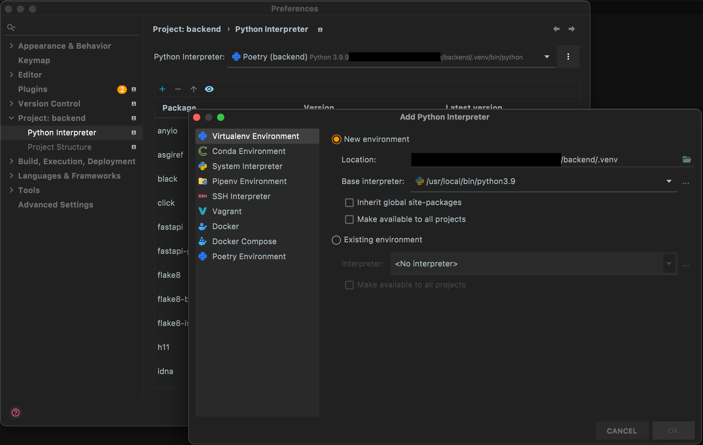
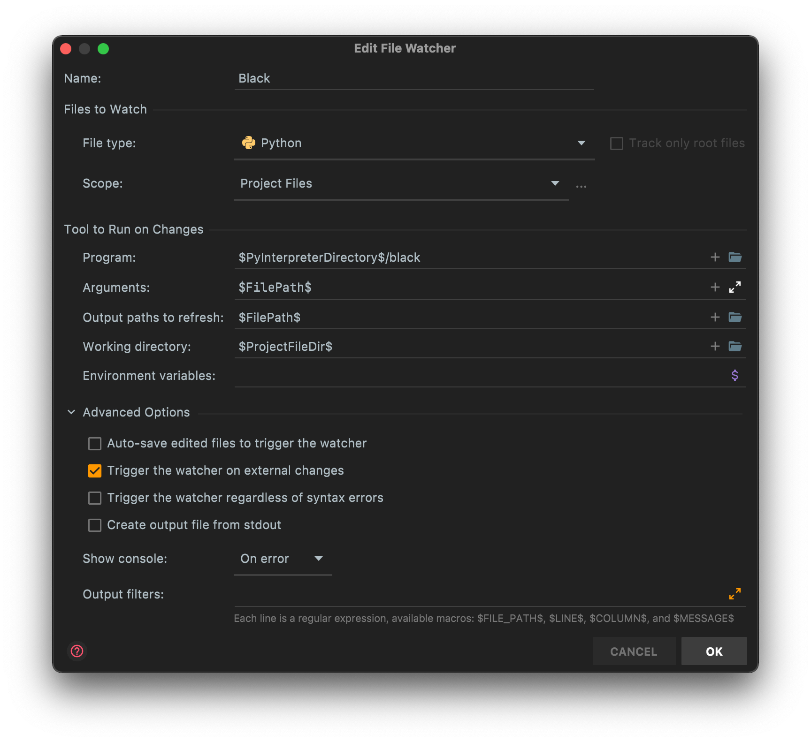

# Welcome to the Karman backend contributing guide

Thank you for your interest in contributing to the Karman backend. This guide will give you an overview of the contribution workflow.

## New contributor guide

The Karman project is quite complex in that it consists of multiple independent applications that work closely together. To get an overview of the Karman vision as well as how the different parts tie together, read the README.md in the [Karaoke-Manager/karman](https://github.com/Karaoke-Manager/karman) repository.

This contribution guide is concerned only with the Karman backend. To get started with the project, read this project’s [README](README.md).

## Issues and Pull Requests

Issues and pull requests are the main way of communicating changes to the codebase. Issues are usually more related to features and ideas whereas pull requests are related to an actual set of changes to the code. Feel free to open issues and start discussions.

If you want to propose your own changes to the code please do open a pull request. Note that we follow [GitHub Flow](https://docs.github.com/en/get-started/quickstart/github-flow) so please read that document to get an overview of the pull request process. We recommend that you name your branches `feature/<name>` where `<name>` is an indication of the feature or change you are working on.

If you are working on a new feature that others might be working on as well, we recommend opening an issue to let others know what you’re up to. This avoids situations where multiple people are working on the same feature without knowing about each other. Likewise before you start working on a feature, search for open issues of people that might have already started.

### Different kinds of code changes

When contributing code be aware of the fact, that the public API of the Karman backend cannot change arbitrarily. The API is the interface between the backend and the frontend so any changes need to be properly coordinated between the two. Because of this pull requests that involve API changes usually take longer and need to be reviewed by someone working on the frontend as well.

We recommend that you split your pull requests whenever possible to separate API changes from implementation changes.

## Working with the code

Editing the code should be straight forward. Use your favorite editor or IDE and just start typing. There are however some best practices you should follow in order to get your pull requests approved.

### Keep the coding style consistent

We follow not only PEP 8 but a stricter set of rules imposed by the [Black](https://black.readthedocs.io/en/stable/) formatter. Luckily the `black` command is able to automatically format your code. Similarly we use [isort](https://pycqa.github.io/isort/) to enforce a consistent order when importing python modules. `isort` is also able to automatically sort the imports. You can run them using the following commands:

```shell
# Running black
black .
# Running isort
isort .
```

There are however some requirements that cannot be fixed automatically. Concerning coding style this includes overlong lines for example. You can find these issues by running

```shell
flake8
```

### Use typed python

The Karman backend uses typed python. This means that every definition should have a clearly indicated (or easily inferred) static type. In some cases this is necessary for FastAPI to work, in other cases it is just helpful for the developer. We use [mypy](http://mypy-lang.org) for type-checking. While mypy is not perfect, it can find many issues (such as missing type annotations on functions). You can run mypy with a simple command:

```shell
mypy
```

This will report any type errors that mypy finds.

### Linting

You can combine the coding style checks and mypy into a single

```shell
poe lint
```

command. This is exactly what we do in our CI and we require pull requests to pass this check before they can be merged. We recommend that you fix all linting errors before you open a pull requests.

## Project Setup

This section guides you through setting up a local development environment to work on the Karman backend.

### Getting the code

Clone the repository locally by running

```shell
git clone https://github.com/Karaoke-Manager/backend
cd backend
```

### Setting up the Python environemnt

It is recommended that you do your development in a python virtual environment (`venv`). If you are using PyCharm or similar IDEs you create a new project interpreter and select a `Virtualenv Environment`. We highly recommend putting the virtual environment inside a `.venv` directory in the project folder to be able to easily use the `poetry` package manager. If you are using the Poetry PyCharm plugin you can also directly create a `Poetry Environment` which basically does the same thing.

If you are using another editor or want to setup the project manually, navigate into the project folder and run

```shell
python3 -m venv .venv
```

### Installing project dependencies

We are using [Poetry](http://python-poetry.org) as our dependency manager so you might need to install that. We recommend installing Poetry **outside** of the project’s virtual environment:

```shell
brew install poetry  # For Homebrew or Linuxbrew
# OR
pip install poetry  # Using your system's python installation
```

To install all the required dependencies navigate into the project folder and run

```shell
poetry install --extras "tests"
```

By specifying the `--extras "tests"` Poetry will install additional dependencies to be able to run the tests.

Now run

```shell
poetry shell
```

to activate the virtual environment. All subsequent commands will run in the poetry shell.

If you are using PyCharm and have configured the virtual environment as described above you can use the integrated terminal emulator. It will automatically use the virtual environment.

### Working with the project

For convenience the project includes some management commands that can be run using [`poe`](https://github.com/nat-n/poethepoet). `poe` is automatically installed as a dependency. To see the available commands, run

```shell
poe --help
# or if you aren't inside of the poetry shell
poetry run poe --help
```

The most important command you are probably looking for is

```shell
poe serve
```

This will start a development server of the backend that will allow you to browse the API docs and more. The development server will automatically reload your code when it changes (unless there are syntax errors in which case you might need to restart the server).

### Browsing the API documentation

Because we are using FastAPI the Karman backend has an auto-generated API documentation for almost all endpoints. You can open the documentation by running the development server and navigating to http://localhost:8000/v1/docs or http://localhost:8000/v1/redoc. Note the `v1` in the path.

## Database Setup

In order to be able to run the backend you need a database connection. By default Karman is configured to use an SQLite database in the `db.sqlite` file. This is usually fine for development but can be changed via the `db_url` setting.

To work with databases you need the appropriate database drivers. These can be installed as follows:

```shell
# SQLite (easiest for development)
poetry install --extras "sqlite"
# MySQL / MariaDB
poetry install --extras "mysql"
# PostgreSQL
poetry install --extras "postgresql"
```

### Creating migrations

Whenever you modify a database model we need to migrate the database schema. For this purpose we use [Alembic](https://alembic.sqlalchemy.org). Giving a full introduction into Alembic is outside the scope of this document so we can only cover the most basic cases.

After you make changes to a model, you can automatically create migrations by running the following command:

```shell
poe makemigration "<message>"
```

`<message>` is intended for a concise description of the changes made and will be used as part of the migration filename.

In most cases the auto generated migrations should be fine but in some cases it is necessary to edit the migration files manually afterwards. The [Alembic Docs](https://alembic.sqlalchemy.org/en/latest/autogenerate.html#what-does-autogenerate-detect-and-what-does-it-not-detect) give a list of modifications that are not automatically detected. Some notable examples are:

- Changes of table and column names
- Some changes to single-column constraints

Addressing these is usually simple, for example using the [`rename_table`](https://alembic.sqlalchemy.org/en/latest/ops.html#alembic.operations.Operations.rename_table) operation in a migration.

If more complex migrations or conditional migrations are necessary these have to be written manually in most cases.

### Applying migrations

You can apply migrations by running

```shell
poe migrate [<revision>]
```

By default all migrations will be applied but you can specifiy a specific revision you want to migrate to. See [Relative Migration Identifiers](https://alembic.sqlalchemy.org/en/latest/tutorial.html#relative-migration-identifiers) for details.

### Undoing migrations

You can roll back migrations by running

```shell
poe rollback [<revision>]
```

By default only a single migration will be rolled back but you can specify a relative or absolute migration identifier to roll back to that specific revision. See [Relative Migration Identifiers](https://alembic.sqlalchemy.org/en/latest/tutorial.html#relative-migration-identifiers) for details.

## Logging

Karman uses the default Python `logging` library for its logs. Logging should be configured out of the box but can be customized via the `logging.yml` file in the project directory as well as using the `logging_config` settings value.

If you are implementing a new endpoint or function in Karman you should use logging in appropriate places to make sure that potential errors can be found in production use. Do make use of different logging levels to reduce the number of logs being shown (a lot of logs can impact performance negatively). Please use the following logger names:

- `karman.api`: Logs related to the parsing and processing of API requests.
- `karman.auth`: Logs related to user and client authentication.
- `karman.library`: Logs related to library management.
- *More loger names might be defined in the future.*

Example usage:

```python
import logging
logger = logging.getLogger("karman.api")
logger.info("This is a log message.")
```


## PyCharm Setup

In this section we give some additional recommendations for setting up a PyCharm based development environment. Other editors and IDEs can probably be configured similarly.

### Project Interpreter

As described above you should configure your project interpreter to reside in a `.venv` subdirectory of the project. If you are using the Poetry plugin for PyCharm you can also use a Poetry environment instead.



### Run Configurations

You can easily configure a run configuration for any of the `poe` commands by creating a Python configuration that runs the module `poethepoet` with a parameter identifying the intended command. Be sure to set the working directory to the project directory! For example you can create a configuration for the development server like this:


If you enable the `Emulate terminal in output console` option you will see colored output.

### File Watchers

PyCharm can automatically run programs when a file is saved. This can be very useful to automatically format the code according to our coding standards. You can do this by configuring a File Watcher.

Navigate in the PyCharm settings to Tools > File Watchers and add a file watcher like this:



This file watcher formats python files using the `black` command when they are saved. Note that at the bottom we removed the `Auto-save edited files to trigger the watcher`. If you enable this option PyCharm will try to continually save files. If you are a fast typer you might run into conflicts where Black changes the file at the same time you are writing which causes annoying error messages.
