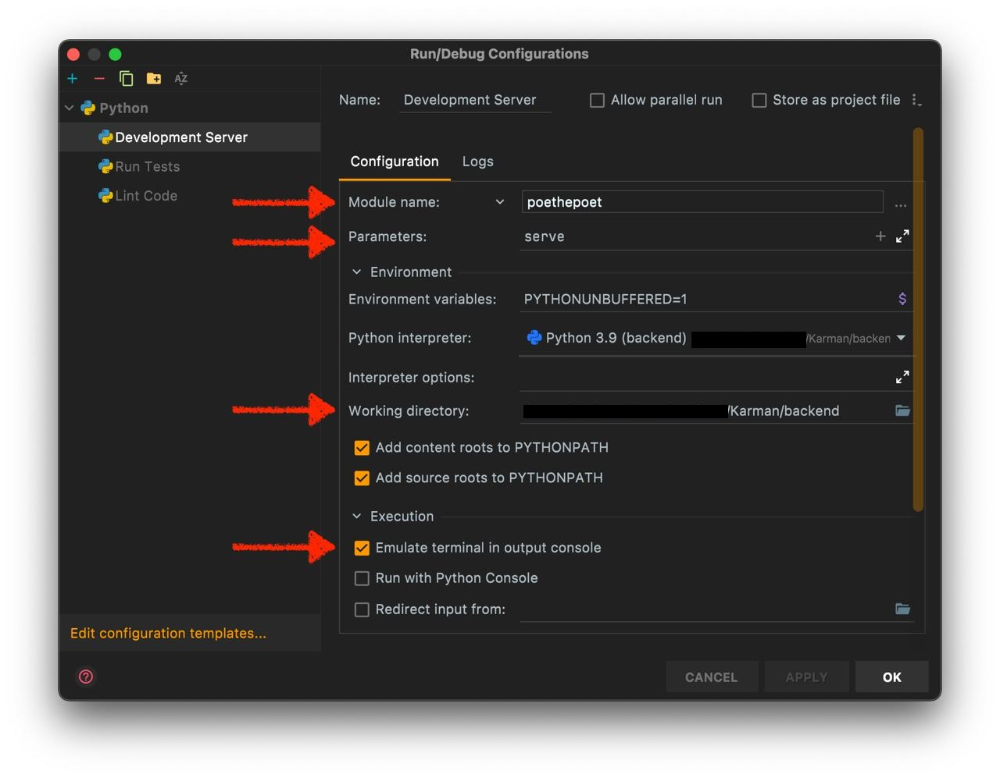

# Karman Backend

The Karman API, written in Python/[FastAPI](https://fastapi.tiangolo.com).

## Getting Started

This project uses [Poetry](https://python-poetry.org) as its dependency manager and [Poe](https://github.com/nat-n/poethepoet) as its task runner. In order to get up and running with this project, install poetry:

```shell
brew install poetry
# OR
pip3 install poetry
```

Then install the project’s dependencies:

```shell
poetry install
# To use the 
```

Now you are ready to run the app:

```shell
poetry run poe serve
```

If you have poetry configured using virtual environments (which is the default) you might want to active that environment by running. By doing so you do not need the `poetry run` prefix for commands:

```shell
poetry shell
```

To view all available commands run

```shell
poe --help
# OR
poetry run poe --help
```

## Running Tests

In order to run tests install the required testing dependencies by running

```shell
poetry install --extras tests
```

Then run the tests by running

```shell
poe test
```

You can also generate a code coverage report by running

```shell
poe test --cov --cov-report=html
```

## Running the Karman API in production

In order to run a production instance of the Karman API you need to run the following commands:

```shell
# 1. Install poetry
pip3 install poetry
# 2. Install runtime dependencies
poetry install --extras uvicorn --no-dev --no-root
# 3. Run the app
uvicorn karman:app --host 0.0.0.0 --port 80
```

In step 2 we install the runtime dependencies and the `uvicorn` extras. This will install the `uvicorn` ASGI server that can be used to run a production instance of Karman. You can use other ASGI servers such as `hypercorn` as well.

## API Documentation

You can view the OpenAPI specification of the Karman API by running the project locally (see above) and then navigating to http://127.0.0.1:8000/v1/docs or http://127.0.0.1:8000/v1/redoc.

# Configuring pyCharm


